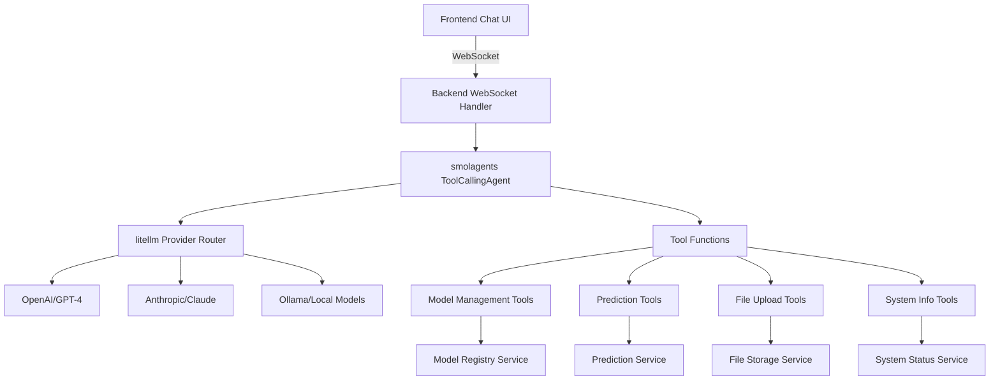

# Chat System Redesign Feature Document

## Overview

This document outlines the redesign of the current rigid chat system to a more flexible, AI-powered solution using WebSocket communication and ChatGPT API with tool calling capabilities.

## Current System Analysis

### Current Architecture Limitations

1. **Rigid Logic**: Frontend determines API endpoints based on simple string matching
2. **Limited Flexibility**: Hard-coded patterns for parsing user intents
3. **Poor User Experience**: Synchronous POST requests with loading states
4. **Scalability Issues**: Manual parsing logic doesn't scale to complex requests
5. **No Context Awareness**: Each request is processed independently

### Current Implementation

```typescript
// Frontend decides which endpoint to call
if (inputMessage.toLowerCase().includes("predict") && inputMessage.includes("{")) {
  response = await apiClient.chatPredict(inputMessage);
} else {
  response = await apiClient.chatWithModels(inputMessage);
}
```

```python
# Backend uses regex patterns and string matching
model_pattern = r"(?:using|with|for)\s+(\w+(?:\s+\w+)*?)\s+(?:model\s+)?(?:with|using)"
data_pattern = r"\{[^}]+\}"
```

## Proposed Architecture

### High-Level Design



### Key Components

1. **WebSocket Communication Layer**
2. **Provider-Agnostic AI Service (smolagents + litellm)**
3. **Tool Calling Framework (smolagents-based)**
4. **Backend Tool System**
5. **Enhanced Frontend Chat Component**

## Technical Specifications

### 1. WebSocket Communication

#### Frontend Changes
- Replace HTTP POST requests with WebSocket connection
- Implement real-time message streaming
- Handle connection states (connecting, connected, disconnected)
- Support message chunking for large responses

#### Backend Changes
- Add WebSocket endpoint using FastAPI WebSocket support
- Implement connection management
- Add message queuing and rate limiting
- Support concurrent connections

### 2. Provider-Agnostic AI Integration (smolagents + litellm)

#### Core AI Layer
- Use `smolagents.ToolCallingAgent` as the core chat intelligence
- Leverage `litellm.LiteLLMModel` for provider-agnostic model access
- Support multiple providers: OpenAI, Anthropic, Ollama, etc.
- Implement conversation context management through smolagents
- Add token usage tracking and optimization via litellm

#### Tool Calling Framework (Using @tool Decorated Functions)
```python
# backend/app/services/chat_agent.py
from smolagents import ToolCallingAgent, LiteLLMModel
from plexe.tools import ALL_TOOLS  # Import all decorated tools

class ChatAgent:
    """
    Provider-agnostic conversational agent for ML model management.
    
    This follows the same pattern as plexe's ConversationalAgent, using
    decorated tool functions directly with the ToolCallingAgent.
    """
    
    def __init__(self, model_id: str = "openai/gpt-4o-mini", verbose: bool = False):
        self.model_id = model_id
        self.verbose = verbose
        
        # Create the agent with all decorated tools - no manual routing needed
        self.agent = ToolCallingAgent(
            name="MLModelAssistant",
            description=(
                "Expert ML assistant that helps users manage machine learning models, "
                "make predictions, and navigate the ML workflow. Provides guidance on "
                "model deployment, feature requirements, and prediction interpretation. "
                "Can list models, get model information, make predictions, validate features, "
                "check system status, and help with file uploads."
            ),
            model=LiteLLMModel(model_id=self.model_id),
            tools=ALL_TOOLS,  # Pass decorated functions directly
            add_base_tools=False,
            verbosity_level=1 if verbose else 0,
        )
    
    async def chat(self, message: str, context: list = None) -> str:
        """Process a chat message and return the response."""
        try:
            return await self.agent.run(message, context=context)
        except Exception as e:
            logger.error(f"Chat processing failed: {str(e)}")
            return f"I encountered an error processing your request: {str(e)}"

# Usage in WebSocket handler
async def handle_chat_message(websocket, message: str, chat_agent: ChatAgent):
    """Handle incoming chat messages via WebSocket."""
    try:
        response = await chat_agent.chat(message)
        await websocket.send_text(json.dumps({
            "type": "message",
            "content": response,
            "timestamp": datetime.now().isoformat()
        }))
    except Exception as e:
        await websocket.send_text(json.dumps({
            "type": "error", 
            "content": f"Failed to process message: {str(e)}",
            "timestamp": datetime.now().isoformat()
        }))
```

### 3. smolagents Tool System

#### Tool Implementation (Following smolagents @tool Pattern)

Tools are implemented as functions decorated with `@tool` from smolagents, with proper type annotations and docstrings:

```python
# plexe/tools/models.py
from typing import List, Optional, Dict, Any
from smolagents import tool
from pydantic import BaseModel

import logging
from ...services.registry import model_registry

logger = logging.getLogger(__name__)

class ModelInfo(BaseModel):
    id: str
    name: str
    status: str
    model_type: str
    feature_names: Optional[List[str]]

@tool
def list_models(status_filter: str = "all") -> List[Dict[str, Any]]:
    """
    List all available ML models.
    
    Args:
        status_filter: Filter models by status ("active", "inactive", "all")
        
    Returns:
        List of model information dictionaries
    """
    try:
        models = model_registry.get_all_models()
        
        if status_filter != "all":
            models = [m for m in models if m.status.value == status_filter]
        
        return [
            {
                "id": m.id,
                "name": m.name,
                "status": m.status.value,
                "model_type": m.model_type.value if m.model_type else "unknown",
                "feature_names": m.feature_names,
                "created_at": m.created_at.isoformat() if hasattr(m, 'created_at') else None
            }
            for m in models
        ]
    except Exception as e:
        logger.error(f"Failed to list models: {str(e)}")
        return []

@tool
def get_model_info(model_id: str) -> Dict[str, Any]:
    """
    Get detailed information about a specific model.
    
    Args:
        model_id: ID of the model to get information for
        
    Returns:
        Detailed model information dictionary
    """
    try:
        model = model_registry.get_model(model_id)
        
        return {
            "id": model.id,
            "name": model.name,
            "status": model.status.value,
            "model_type": model.model_type.value if model.model_type else "unknown",
            "feature_names": model.feature_names,
            "description": getattr(model, 'description', None),
            "created_at": model.created_at.isoformat() if hasattr(model, 'created_at') else None,
            "file_size": getattr(model, 'file_size', None)
        }
    except Exception as e:
        logger.error(f"Failed to get model info for {model_id}: {str(e)}")
        return {"error": f"Model not found: {model_id}"}

@tool
def delete_model(model_id: str) -> Dict[str, str]:
    """
    Delete a model from the registry.
    
    Args:
        model_id: ID of the model to delete
        
    Returns:
        Result of the deletion operation
    """
    try:
        model = model_registry.get_model(model_id)
        model_name = model.name
        
        # Delete from registry (this should handle file cleanup too)
        model_registry.delete_model(model_id)
        
        return {
            "status": "success",
            "message": f"Successfully deleted model '{model_name}' (ID: {model_id})"
        }
    except Exception as e:
        logger.error(f"Failed to delete model {model_id}: {str(e)}")
        return {
            "status": "error", 
            "message": f"Failed to delete model: {str(e)}"
        }

# plexe/tools/predictions.py
from smolagents import tool
from typing import Dict, Any
import logging
from ...services.predictor import prediction_service
from ...services.registry import model_registry

logger = logging.getLogger(__name__)

@tool
def make_prediction(model_id: str, features: Dict[str, Any]) -> Dict[str, Any]:
    """
    Make a prediction using a specified model.
    
    Args:
        model_id: ID of the model to use for prediction
        features: Input features as key-value pairs
        
    Returns:
        Prediction result with confidence information
    """
    try:
        result = prediction_service.predict(model_id, features)
        
        return {
            "prediction": result.prediction,
            "probability": result.probability,
            "confidence": result.confidence,
            "model_id": result.model_id,
            "status": "success"
        }
    except Exception as e:
        logger.error(f"Prediction failed for model {model_id}: {str(e)}")
        return {
            "status": "error",
            "message": f"Prediction failed: {str(e)}",
            "model_id": model_id
        }

@tool
def validate_features(model_id: str, features: Dict[str, Any]) -> Dict[str, Any]:
    """
    Validate input features for a model without making a prediction.
    
    Args:
        model_id: ID of the model to validate features for
        features: Input features to validate
        
    Returns:
        Validation result with any errors or warnings
    """
    try:
        model = model_registry.get_model(model_id)
        
        # Validation logic
        missing_features = []
        if model.feature_names:
            missing_features = [f for f in model.feature_names if f not in features]
        
        extra_features = []
        if model.feature_names:
            extra_features = [f for f in features.keys() if f not in model.feature_names]
        
        is_valid = len(missing_features) == 0
        
        return {
            "valid": is_valid,
            "missing_features": missing_features,
            "extra_features": extra_features,
            "message": "Features are valid" if is_valid else f"Missing required features: {missing_features}",
            "model_id": model_id
        }
    except Exception as e:
        logger.error(f"Feature validation failed for model {model_id}: {str(e)}")
        return {
            "valid": False,
            "message": f"Validation failed: {str(e)}",
            "model_id": model_id
        }

# plexe/tools/files.py
from smolagents import tool
from typing import Dict, Any
import logging

logger = logging.getLogger(__name__)

@tool
def get_upload_status(upload_id: str) -> Dict[str, Any]:
    """
    Check the status of a file upload operation.
    
    Args:
        upload_id: ID of the upload to check
        
    Returns:
        Upload status information
    """
    try:
        # Implementation would check upload status from storage/cache
        # For now, return a placeholder
        return {
            "upload_id": upload_id,
            "status": "completed",
            "message": "Upload status checking not yet implemented"
        }
    except Exception as e:
        logger.error(f"Failed to get upload status for {upload_id}: {str(e)}")
        return {
            "upload_id": upload_id,
            "status": "error",
            "message": f"Failed to check status: {str(e)}"
        }

# plexe/tools/system.py
from smolagents import tool
from typing import Dict, Any
import logging

logger = logging.getLogger(__name__)

@tool
def get_system_status() -> Dict[str, Any]:
    """
    Get current system health and status information.
    
    Returns:
        System status information including model count, memory usage, etc.
    """
    try:
        from ...services.registry import model_registry
        
        models = model_registry.get_all_models()
        active_models = [m for m in models if m.status.value == "active"]
        
        return {
            "status": "healthy",
            "total_models": len(models),
            "active_models": len(active_models),
            "timestamp": datetime.now().isoformat()
        }
    except Exception as e:
        logger.error(f"Failed to get system status: {str(e)}")
        return {
            "status": "error",
            "message": f"Failed to get status: {str(e)}"
        }

@tool
def get_available_commands() -> Dict[str, str]:
    """
    Get help information about available commands and usage.
    
    Returns:
        Dictionary of available commands and their descriptions
    """
    return {
        "list_models": "List all available models with optional status filtering",
        "get_model_info": "Get detailed information about a specific model",
        "delete_model": "Delete a model from the system",
        "make_prediction": "Make a prediction using a specified model",
        "validate_features": "Validate input features for a model",
        "get_system_status": "Get current system health information",
        "get_upload_status": "Check the status of a file upload"
    }
```

#### Tool Organization and Import Pattern
```python
# plexe/tools/__init__.py
"""Import all tools for easy registration with agents."""

from .models import list_models, get_model_info, delete_model
from .predictions import make_prediction, validate_features
from .files import get_upload_status
from .system import get_system_status, get_available_commands

# List of all available tools for agent registration
ALL_TOOLS = [
    list_models,
    get_model_info, 
    delete_model,
    make_prediction,
    validate_features,
    get_upload_status,
    get_system_status,
    get_available_commands,
]
```

### 4. Enhanced Frontend

#### WebSocket Client
```typescript
class ChatWebSocketClient {
  private ws: WebSocket | null = null;
  private messageQueue: Message[] = [];
  private reconnectAttempts = 0;
  private maxReconnectAttempts = 5;

  connect(url: string) {
    this.ws = new WebSocket(url);
    this.setupEventHandlers();
  }

  sendMessage(message: string) {
    if (this.ws?.readyState === WebSocket.OPEN) {
      this.ws.send(JSON.stringify({ type: 'chat', content: message }));
    } else {
      this.messageQueue.push({ content: message, timestamp: Date.now() });
    }
  }

  private setupEventHandlers() {
    this.ws!.onopen = () => {
      this.reconnectAttempts = 0;
      this.flushMessageQueue();
    };

    this.ws!.onmessage = (event) => {
      const data = JSON.parse(event.data);
      this.handleMessage(data);
    };

    this.ws!.onclose = () => {
      this.handleReconnect();
    };
  }
}
```

#### Real-time Message Streaming
- Support for streaming responses from ChatGPT
- Real-time typing indicators
- Message status indicators (sending, delivered, error)
- Automatic retry mechanism

### 5. Configuration Management

#### Environment Variables (Provider-Agnostic)
```env
# AI Provider Configuration (litellm format)
DEFAULT_AI_PROVIDER=openai/gpt-4o-mini
FALLBACK_AI_PROVIDER=anthropic/claude-3-haiku-20240307

# Provider API Keys (as needed)
OPENAI_API_KEY=sk-...
ANTHROPIC_API_KEY=sk-ant-...
OLLAMA_BASE_URL=http://localhost:11434

# AI Model Configuration
AI_MAX_TOKENS=4096
AI_TEMPERATURE=0.1
AI_TIMEOUT=30

# WebSocket Configuration
WEBSOCKET_TIMEOUT=30
WEBSOCKET_MAX_CONNECTIONS=100
WEBSOCKET_PING_INTERVAL=30

# Chat Configuration
CHAT_CONTEXT_WINDOW=50
CHAT_MAX_HISTORY=1000
CHAT_RATE_LIMIT=60  # messages per minute
```

#### Settings Schema
```python
from typing import Optional
from pydantic_settings import BaseSettings

class ChatSettings(BaseSettings):
    # AI Provider Configuration
    default_ai_provider: str = "openai/gpt-4o-mini"
    fallback_ai_provider: Optional[str] = "anthropic/claude-3-haiku-20240307"
    
    # Provider API Keys
    openai_api_key: Optional[str] = None
    anthropic_api_key: Optional[str] = None
    ollama_base_url: Optional[str] = "http://localhost:11434"
    
    # AI Model Configuration
    ai_max_tokens: int = 4096
    ai_temperature: float = 0.1
    ai_timeout: int = 30
    
    # WebSocket Configuration
    websocket_timeout: int = 30
    websocket_max_connections: int = 100
    websocket_ping_interval: int = 30
    
    # Chat Configuration
    chat_context_window: int = 50
    chat_max_history: int = 1000
    chat_rate_limit: int = 60
    
    class Config:
        env_file = ".env"

# Provider selection logic
def get_chat_agent(settings: ChatSettings, verbose: bool = False) -> ChatAgent:
    """Create a chat agent with the configured provider."""
    try:
        return ChatAgent(model_id=settings.default_ai_provider, verbose=verbose)
    except Exception as e:
        if settings.fallback_ai_provider:
            logger.warning(f"Primary provider failed: {e}. Falling back to {settings.fallback_ai_provider}")
            return ChatAgent(model_id=settings.fallback_ai_provider, verbose=verbose)
        raise
```

## Implementation Plan

### Phase 1: Backend Foundation (Week 1-2)

1. **WebSocket Infrastructure**
   - Add WebSocket endpoint to FastAPI
   - Implement connection management
   - Add message routing and error handling

2. **smolagents Integration**
   - Set up ToolCallingAgent with litellm
   - Implement conversation context management
   - Add token usage tracking via litellm

3. **Tool Framework**
   - Create @tool decorated functions following plexe patterns
   - Implement tool modules (models, predictions, files, system)
   - Add basic tools (list_models, get_model_info)
   - Set up tool import structure with ALL_TOOLS list

### Phase 2: Core Tools Implementation (Week 2-3)

1. **Model Management Tools**
   - Implement all @tool decorated model functions
   - Add comprehensive error handling and logging
   - Add validation and security checks
   - Follow patterns from datasets.py and conversation.py

2. **Prediction Tools**
   - Implement @tool decorated prediction functions
   - Add batch prediction support
   - Add feature validation tools
   - Ensure proper error handling and status reporting

3. **File Management Tools**
   - Implement @tool decorated file functions
   - Add progress tracking via WebSocket
   - Add file validation and security
   - Consider file upload tool similar to validate_dataset_files

### Phase 3: Frontend Redesign (Week 3-4)

1. **WebSocket Client**
   - Implement WebSocket client with reconnection
   - Add message queuing and retry logic
   - Add connection status indicators

2. **Enhanced Chat UI**
   - Add real-time message streaming
   - Implement typing indicators
   - Add message status indicators
   - Improve error handling and user feedback

3. **File Upload Integration**
   - Integrate file upload with WebSocket
   - Add progress bars and status updates
   - Add drag-and-drop improvements

### Phase 4: Testing and Optimization (Week 4-5)

1. **Testing**
   - Unit tests for all tools
   - Integration tests for WebSocket communication
   - End-to-end tests for chat functionality
   - Load testing for concurrent connections

2. **Performance Optimization**
   - Optimize token usage
   - Implement response caching
   - Add rate limiting and throttling
   - Optimize WebSocket message handling

3. **Security and Monitoring**
   - Add authentication and authorization
   - Implement audit logging
   - Add monitoring and alerting
   - Security testing and validation

## Dependencies and Requirements

### Backend Dependencies
```python
# New dependencies to add to requirements.txt
smolagents==0.3.4  # Core agent framework
litellm==1.56.0    # Provider-agnostic LLM interface
websockets==12.0   # WebSocket support
redis==5.0.1       # For session management and caching
python-jose[cryptography]==3.3.0  # For JWT tokens

# Provider-specific dependencies (optional, based on usage)
openai>=1.12.0     # For OpenAI models
anthropic>=0.40.0  # For Anthropic models
# ollama automatically supported via litellm
```

### Frontend Dependencies
```json
{
  "dependencies": {
    "ws": "^8.16.0",
    "@types/ws": "^8.5.10",
    "reconnecting-websocket": "^4.4.0"
  }
}
```

### Infrastructure Requirements
- Redis instance for session management and caching
- API keys for chosen AI providers (OpenAI, Anthropic, etc.)
- Optional: Local Ollama instance for self-hosted models
- WebSocket-compatible hosting environment
- Enhanced monitoring and logging

## Security Considerations

### Authentication and Authorization
- JWT-based authentication for WebSocket connections
- Rate limiting per user/session
- Input validation and sanitization
- Tool access control and permissions

### Data Privacy
- Conversation data encryption
- PII detection and handling
- Data retention policies
- Audit logging for compliance

### API Security
- AI provider API key protection (OpenAI, Anthropic, etc.)
- Request/response validation
- Error message sanitization
- DDoS protection

## Monitoring and Observability

### Metrics
- WebSocket connection counts and duration
- Message throughput and latency
- Tool execution times and success rates
- AI provider API usage and costs (via litellm tracking)
- Model performance across different providers
- Error rates and types

### Logging
- Structured logging for all components
- Chat conversation logging (with privacy controls)
- Tool execution logs
- Performance metrics logging

### Alerting
- High error rates
- WebSocket connection failures
- AI provider API quota limits or failures
- Provider failover events
- System performance degradation

## Migration Strategy

### Backward Compatibility
- Maintain existing HTTP endpoints during transition
- Gradual feature flag rollout
- A/B testing for user experience comparison
- Rollback plan for critical issues

### Data Migration
- Existing chat history preservation
- Model metadata migration
- User preference migration
- Session data migration

### Deployment Strategy
- Blue-green deployment for zero downtime
- Canary releases for gradual rollout
- Feature flags for component-level control
- Monitoring and rollback procedures

## Success Metrics

### User Experience
- Reduced response time (target: <2s for simple queries)
- Improved user satisfaction scores
- Increased chat session duration
- Reduced error rates

### Technical Performance
- WebSocket connection stability (>99.5% uptime)
- Message delivery reliability (>99.9%)
- Tool execution success rate (>95%)
- API response time improvements

### Business Impact
- Increased user engagement
- Reduced support tickets
- Improved model deployment success rate
- Enhanced system scalability

## Conclusion

This redesign transforms the current rigid chat system into a flexible, provider-agnostic AI-powered interface that can handle complex user requests naturally. The WebSocket-based architecture provides real-time communication, while smolagents with litellm integration enables intelligent request routing and execution across multiple AI providers.

**Key Benefits of the smolagents + litellm Approach:**

1. **Provider Agnostic**: Instant support for OpenAI, Anthropic, Ollama, and other providers
2. **Fallback Resilience**: Automatic failover between providers
3. **Cost Optimization**: Easy switching between models based on cost/performance needs
4. **Future-Proof**: New providers automatically supported through litellm updates
5. **Local Options**: Support for self-hosted models via Ollama

The phased implementation approach ensures minimal disruption to existing functionality while providing a clear path to enhanced capabilities. The comprehensive monitoring and security measures ensure the system is production-ready and maintainable.

This architecture positions the system for future enhancements such as multi-modal interactions, advanced analytics, and seamless integration with new AI providers as they emerge. 